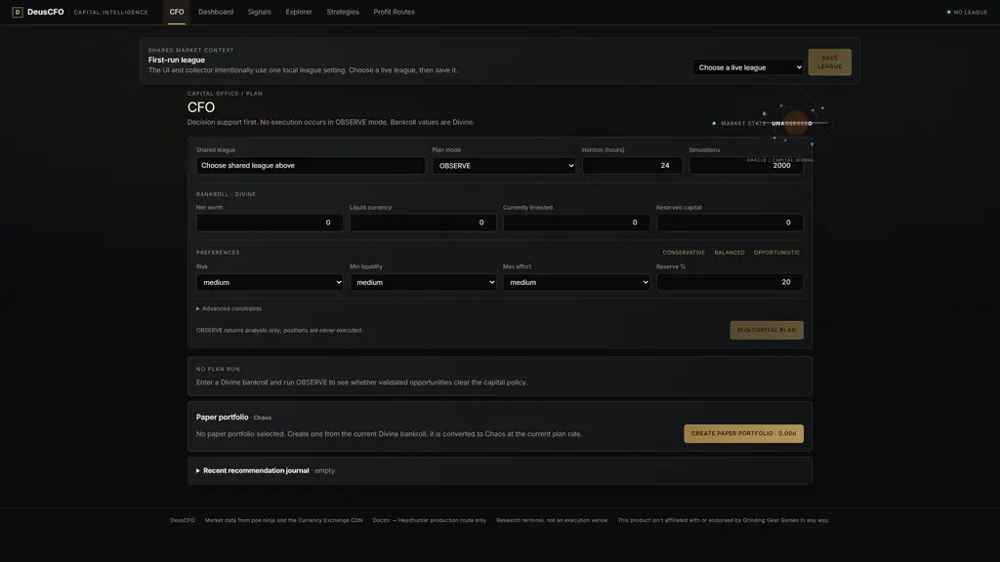
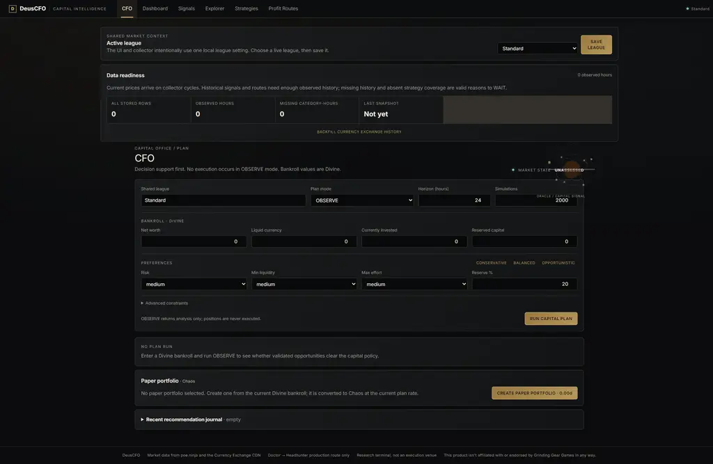

# DeusCFO

[](https://github.com/MetzeVanDeus/deus-cfo/actions/workflows/ci.yml)

**DeusCFO is a local Path of Exile market-research terminal that tracks historical prices, tests market signals, and identifies evidence-backed opportunities without pretending every theoretical profit is executable.** It is decision support and paper tracking, not an automated trade or gameplay tool.

## Public-beta screenshots

Captured from the packaged Windows service at a 1920×1080 browser viewport; screenshots show repository behavior with no fabricated market data.



*First run: no saved league; child panels show “Choose shared league above” and controls remain disabled until the shared context is saved.*



*Configured Standard: zero stored rows and zero observed hours, so readiness truthfully remains a WAIT state while collection begins.*

## Download and run

A Windows download, when a tagged release has been published, is available from [GitHub Releases](https://github.com/MetzeVanDeus/deus-cfo/releases). The local packaging path is [`scripts/build_windows.ps1`](scripts/build_windows.ps1): it builds the frontend, packages the service with pinned PyInstaller, and emits `SHA256SUMS.txt`. Releases are checksummed but not signed; this repository does not claim clean-machine verification.

For a source checkout on Windows:

```powershell
python -m venv .venv
python -m pip install -r backend\requirements.txt
cd frontend
npm ci
cd ..
python deuscfo.py dev
```

`dev` is explicit: it starts Vite on port 3000, the loopback API on port 8000, and the collector. Open <http://127.0.0.1:3000>.

For the normal production path, build `frontend/dist` first, then run:

```powershell
python deuscfo.py start
python deuscfo.py status
python deuscfo.py stop
```

The launcher starts only the loopback backend and collector; FastAPI serves the production frontend at <http://127.0.0.1:8000>. It does not start Vite. Logs are written to `logs/backend.log` and `logs/collector.log`; `status` reports owned PIDs and storage limits; `stop` terminates only DeusCFO-owned processes. The launcher opens port 8000 with `python deuscfo.py open`.

## First run and shared league

On first run, choose a live league in **Shared market context** and save it. The UI and collector read the same ignored local `deuscfo.config.json` (`{ "league": "<id>" }`). If a configured league expires, DeusCFO stops silently drifting: it marks migration required and asks you to choose a current league.

The collector first gathers current poe.ninja snapshots. Historical views become useful as observations accumulate. The **Data readiness** panel shows stored rows, observed hours, missing intervals, and the last snapshot; it also starts bounded Currency Exchange backfill. A first run can therefore show no signals or routes for a while. `WAIT` is a valid result when history, liquidity, patch evidence, or strategy coverage is insufficient. No demo data is inserted.

## What it helps with

- **Research:** inspect price history, regimes, anomalies, and evidence coverage.
- **Decide conservatively:** run capital plans that separate theoretical, non-executable, and executable outcomes.
- **Learn on paper:** record recommendations and paper positions without placing orders.

## Current strategy promise

Production transformation coverage is intentionally narrow: the verified route is **The Doctor → Headhunter** for the patch and leagues declared in `backend/div_card_recipes.json`. Assembly/disassembly, vendor chains, graph routes, six-link routes, and other strategy families have no accepted production records. They remain visibly unsupported rather than being filled with speculative recipes.

A route can remain theoretical or be absent when exact prices, buy-side depth, historical evidence, patch metadata, or liquidation evidence are missing. Headhunter sell depth is never inferred from seller asks. The application never executes trades.

## Data trust and supported upstreams

- `web.poecdn.com/api/currency-exchange` is the documented Currency Exchange CDN API used for hourly historical exchange data.
- poe.ninja supplies current market snapshots and league metadata.
- Project-owner confirmation supports the existing trade-site paths `/api/trade/search`, `/api/trade/fetch`, and `/api/trade/data/static`. They are supported trade-site endpoints, **not** endpoints listed in the official GGG Developer API reference. The collector retains bounded requests and an identifying User-Agent.
The public release does not package a checked-in trade metadata snapshot. Trade metadata is fetched from the supported trade-site endpoint when available; redistribution provenance for any future offline capture must be recorded before it is shipped.

Every result carries evidence and coverage limits where available. Missing history, absent coverage, stale leagues, and unavailable upstreams are surfaced as reasons to wait rather than replaced with estimates.

## Privacy and policy

DeusCFO binds to loopback by default. SQLite market history, journals, paper portfolios, logs, and local configuration remain on your machine. Review logs and free-form notes before sharing diagnostics; see [`docs/privacy.md`](docs/privacy.md).

**This product isn't affiliated with or endorsed by Grinding Gear Games in any way.** Path of Exile and related marks belong to Grinding Gear Games. DeusCFO does not automate gameplay or trade execution. Optional donations are pending GGG guidance and are not linked or feature-gated in this beta.

## Development

Install dependencies:

```powershell
cd frontend
npm ci
cd ..
```

The explicit Vite workflow remains available with `python deuscfo.py dev`, or run the API and frontend separately. Focused backend tests and frontend checks are listed in the project workflow; do not commit runtime databases, `deuscfo.config.json`, raw captures, logs, or `frontend/dist`.

Planning history is under [`docs/design-history`](docs/design-history). Community and release notes are in [`CONTRIBUTING.md`](CONTRIBUTING.md), [`SECURITY.md`](SECURITY.md), [`CHANGELOG.md`](CHANGELOG.md), and [`docs/public-beta-release-notes.md`](docs/public-beta-release-notes.md).
